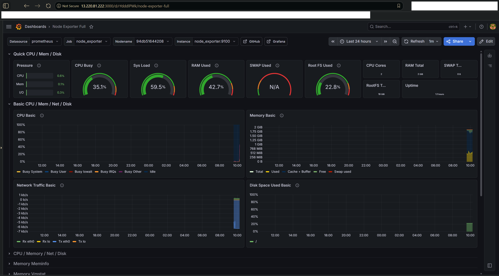
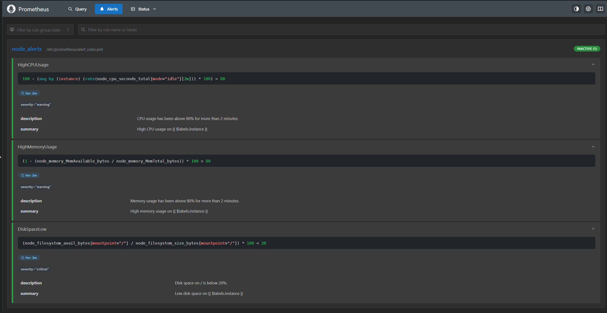
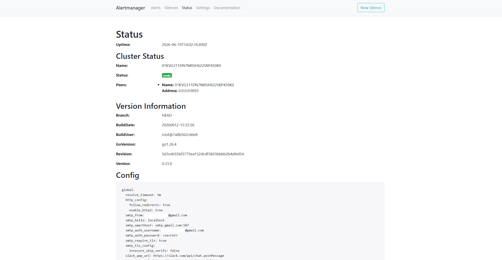
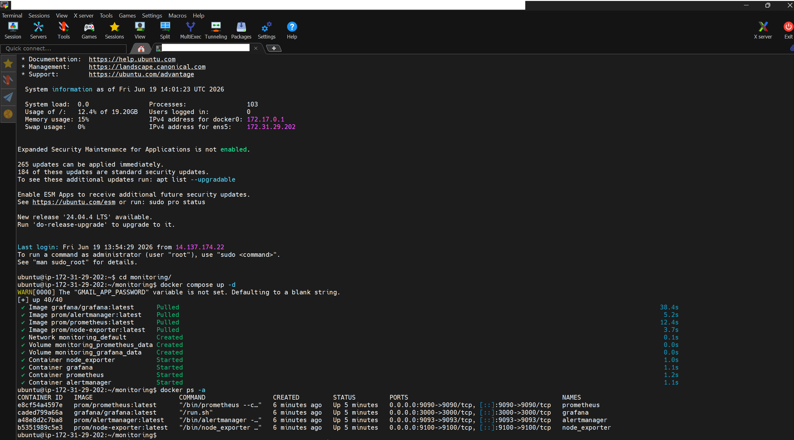

# Prometheus and Grafana Monitoring Stack

**Open source monitoring stack with Prometheus, Grafana, AlertManager, and Node Exporter — running on Docker Compose on an EC2 instance provisioned with Terraform.**

## What This Does

1. Provisions an EC2 instance and security group with Terraform
2. Installs Docker and Docker Compose on the EC2 via userdata script on first boot
3. Runs Prometheus, Grafana, AlertManager, and Node Exporter as Docker containers
4. Node Exporter exposes EC2 system metrics which Prometheus scrapes every 15 seconds
5. Grafana connects to Prometheus as a data source and visualizes metrics on a dashboard
6. Three alert rules fire when CPU, memory, or disk cross defined thresholds
7. AlertManager receives fired alerts from Prometheus and sends email notifications via Gmail SMTP

## The Problem

Without monitoring:
- You have no visibility into what your server is actually doing
- CPU spikes, memory pressure, and low disk space go unnoticed until something breaks
- You find out the server is struggling when the application goes down, not before
- There is no way to track resource usage trends over time

With this setup:
- A single Grafana dashboard shows CPU, memory, disk, and network in real time
- Alert rules watch thresholds continuously and fire the moment something goes wrong
- AlertManager routes fired alerts to your email automatically
- The entire stack spins up with one docker compose command and tears down cleanly

## What Gets Created

- **EC2 Instance** - Ubuntu 22.04 t3.small with Docker installed on boot
- **Security Group** - opens ports 22, 3000, 9090, 9093, and 9100
- **Prometheus** - scrapes Node Exporter every 15 seconds and stores metrics as time-series data
- **Node Exporter** - runs on the EC2 and exposes system metrics at port 9100
- **Grafana** - connects to Prometheus and renders metrics on an interactive dashboard
- **AlertManager** - receives alerts from Prometheus and sends email via Gmail SMTP
- **Alert Rules** - HighCPUUsage, HighMemoryUsage, and DiskSpaceLow with 2-minute evaluation windows

## Infrastructure Verification

#### Grafana Node Exporter Full Dashboard

<h3>Node Exporter Full dashboard showing live CPU, memory, disk, and network metrics from the EC2 instance.</h3>

#### Prometheus Alert Rules

<h3>Three alert rules loaded and evaluated by Prometheus: HighCPUUsage, HighMemoryUsage, and DiskSpaceLow.</h3>

#### AlertManager Status

<h3>AlertManager running and ready with Gmail SMTP configured for email notifications.</h3>

#### Docker Containers Running on EC2

<h3>All four containers running on the EC2: Prometheus, Grafana, AlertManager, and Node Exporter.</h3>

## How to Use

1. Clone this repo
2. Create an EC2 key pair in the AWS console and download the `.pem` file into a `secrets/` folder
3. Generate a Gmail App Password under Google Account > Security > 2-Step Verification > App Passwords
4. Copy `monitoring/alertmanager/alertmanager.yml.example` and fill in your Gmail credentials
5. Create a `.env` file inside the `monitoring/` folder with your `GRAFANA_PASSWORD`
6. Run `terraform init` inside the `terraform/` folder
7. Run `terraform apply` and enter your key pair name and email when prompted
8. Wait 2 minutes for the EC2 to finish installing Docker via userdata
9. Copy the monitoring folder to the EC2 using scp
10. SSH into the EC2, navigate to the monitoring folder, and run `docker compose up -d`
11. Open Grafana at the URL from terraform outputs, log in, add Prometheus as a data source, and import dashboard ID 1860

## Tools Used

- Terraform
- AWS EC2
- Docker
- Docker Compose
- Prometheus
- Grafana
- AlertManager
- Node Exporter

## Files

- `terraform/main.tf` - EC2 instance and security group
- `terraform/variables.tf` - configurable values
- `terraform/outputs.tf` - prints public IP and service URLs after apply
- `terraform/userdata.sh` - installs Docker on EC2 first boot
- `monitoring/docker-compose.yml` - defines all four containers
- `monitoring/prometheus/prometheus.yml` - scrape config and AlertManager connection
- `monitoring/prometheus/alert_rules.yml` - CPU, memory, and disk alert rules
- `monitoring/alertmanager/alertmanager.yml` - Gmail SMTP config for email alerts (not committed)